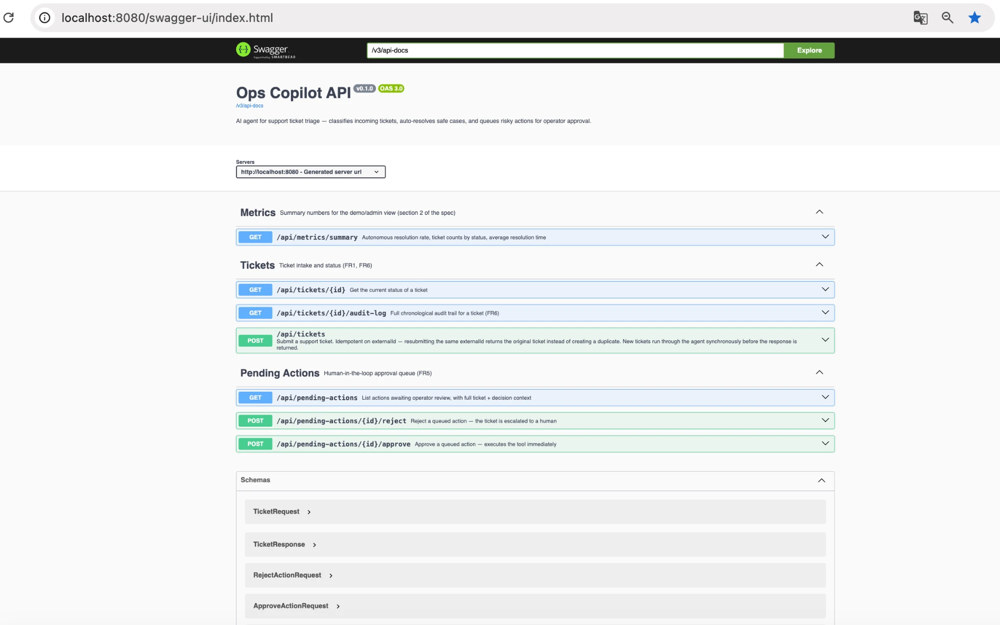
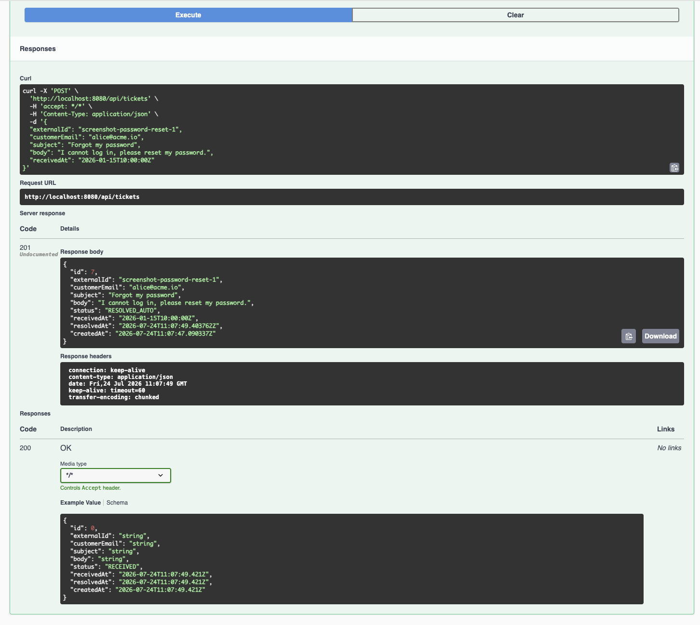
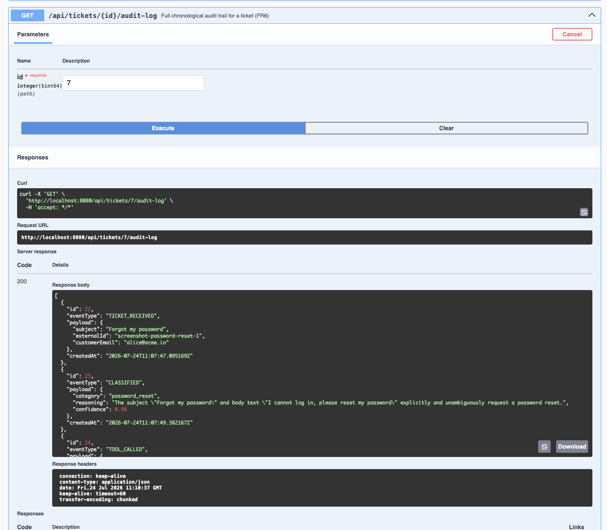
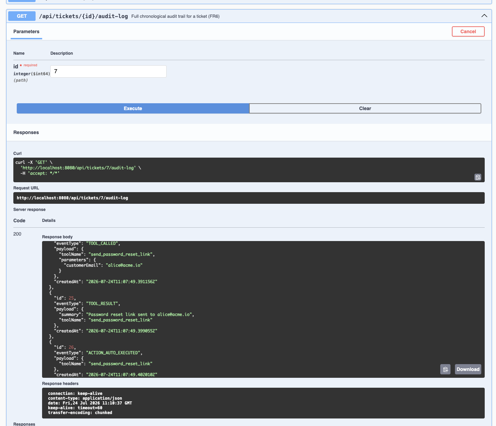

# Ops Copilot

An AI agent that triages incoming support tickets for a B2B SaaS: it classifies intent with
Claude, resolves the routine ~40% of cases itself through real (mocked) backend actions, and
queues anything with financial or account-level consequences for a human to approve. Nothing
executes on the model's say-so alone — every action is independently validated, every risky
action waits for a person, and every decision is written to an append-only audit log.

Built as a portfolio piece to demonstrate production-grade engineering on an AI-agent system,
not a prompt-and-a-prayer prototype. See [§ Why it's built this way](#why-its-built-this-way) for
the reasoning behind the parts that take the most space in the code: idempotency, guardrails,
and the audit trail.

## Contents

- [Screenshots](#screenshots)
- [Architecture](#architecture)
- [Why it's built this way](#why-its-built-this-way)
- [Tech stack](#tech-stack)
- [Running it](#running-it)
- [API reference](#api-reference)
- [Demo scenarios](#demo-scenarios)
- [Tests](#tests)
- [Design decisions worth flagging](#design-decisions-worth-flagging)

## Screenshots

Swagger UI, and a live run of demo scenario 1 (password reset, auto-resolved end to end) against
a real Claude classification — not a mock, this is the actual model's `reasoning` and
`confidence` for that ticket.




*`POST /api/tickets` — the ticket comes back `RESOLVED_AUTO` before the response is even returned.*


*`GET /api/tickets/{id}/audit-log` — real classification: `confidence: 0.98`, and reasoning that
cites the exact words in the ticket.*


*Same audit log, scrolled down — `TOOL_CALLED` → `TOOL_RESULT` → `ACTION_AUTO_EXECUTED`. No human
touched this ticket.*

## Architecture

```
                              POST /api/tickets
                                     |
                                     v
                          TicketController
                                     |
                    idempotent insert by externalId
                    (unique constraint is the real guard;
                     the findByExternalId check is just
                     an optimization for the common case)
                                     |
                                     v
                       TicketIngestionService ------------> Postgres (tickets)
                                     |
                       only if newly created (never on
                       a resubmitted/duplicate webhook)
                                     |
                                     v
                      AgentOrchestrationService  <-- MDC ticketId = correlation ID
                       (the ReAct-style loop, FR8-bounded)
                                     |
                  +------------------+-------------------+
                  |                                       |
        iteration 1: classify                  iteration 2: extract parameters
                  |                             (REQUIRES_APPROVAL tools only —
                  v                              target plan, refund amount)
           LlmClient.classifyTicket                        |
        (Claude Messages API, tool_choice                  v
         forced, retry+backoff inside              LlmClient.extractParameters
         ClaudeLlmClient)                        (same tool_choice + retry pattern)
                  |                                        |
                  v                                        |
          AgentDecision persisted                           |
          CLASSIFIED audit event                            |
                  |                                         |
                  v                                         |
     DecisionEngine.decide(category, confidence, threshold)  |
       -- pure function, zero I/O, table-tested --           |
                  |                                          |
      +-----------+-----------+                              |
      |           |           |                               |
 AutoExecute  QueueForApproval Escalate                        |
      |           |<-----------------------------------------+
      v           v           v
 ToolRegistry  ToolRegistry  escalate_to_human tool
 .get(name)    .get(name)    (always available, no
      |           |          approval needed to escalate)
      v           v
 Tool.execute() PendingActionService
 (RetryExecutor)  .createPendingAction()
      |           (validates, then queues —
      v            never executes here)
 ToolCall row          |
 TOOL_CALLED /         v
 TOOL_RESULT /   PendingAction (status=PENDING)
 ACTION_AUTO_          |
 EXECUTED        operator: GET /api/pending-actions
      |                |
      v          approve/reject
 Ticket.status         |
 = RESOLVED_AUTO   PendingActionRepository
                   .transitionIfPending()
                   -- atomic UPDATE ... WHERE
                      status = 'PENDING' --
                        |            |
                    approved      rejected
                        |            |
                        v            v
                  Tool.execute()  Ticket.status
                  (RetryExecutor)  = ESCALATED
                        |
                        v
                  Ticket.status
                  = RESOLVED_AUTO
```

Every box that touches the database goes through `AuditLogService`, which writes one of the 10
`AuditEventType` values as an append-only row — `audit_log_entries` has database triggers that
reject `UPDATE`/`DELETE` outright, so "append-only" is enforced by Postgres, not just application
convention.

Layers: `controller` → `service` (orchestration + business logic) → `repository` (Spring Data
JPA) → Postgres. `LlmClient` is an interface; `ClaudeLlmClient` is the only implementation, so
swapping providers means adding a class, not touching `AgentOrchestrationService`.

## Why it's built this way

**Idempotency is structural, not procedural.** The obvious way to prevent duplicate tickets is
"check if it exists before inserting" — but that check and the insert aren't atomic, so two
concurrent webhook deliveries with the same `externalId` can both pass the check and both insert.
The actual guarantee here is a `UNIQUE` constraint on `tickets.external_id`; the `findByExternalId`
lookup in `TicketIngestionService` is purely a fast-path optimization that skips the exception
handling on the common case. The same pattern shows up again in the approval flow: `approve`/
`reject` never read a `PendingAction`, decide, then write — they run
`UPDATE pending_actions SET status = 'APPROVED' ... WHERE status = 'PENDING'` and check the
affected-row count. Two concurrent approve calls on the same action race on that single
statement; the database resolves the race, and exactly one of them executes the tool. This is
proven, not asserted — `PendingActionApprovalIT` fires five concurrent approve requests at one
action and checks that precisely one `ToolCall` row exists afterward.

**Guardrails exist because the alternative is an agent that occasionally does something expensive
and irreversible because a JSON field parsed oddly.** Every tool independently validates its own
parameters (`Tool.validateParameters`), whether they came from the ticket itself or from the
model — `issue_refund` rejects a refund over $5000 regardless of what the LLM or an operator
proposed, because that's a business rule the tool owns, not a prompt instruction the model might
ignore. The max-iteration and token-budget caps in `AgentOrchestrationService` aren't just
`if` statements that are never expected to fire: `AgentOrchestrationServiceTest` sets
`maxIterations` to 1 and proves the second-iteration parameter-extraction call — and the LLM call
behind it — never happens. A guardrail nobody can prove works is a comment, not a guardrail.

**The audit log is what makes "the agent decided X" answerable months later, not just at request
time.** Every classification, every tool call, every approval and rejection is a separate,
timestamped, immutable row with the reasoning attached — not a log line that rotates out in a
week. That's the difference between a system a product owner can trust in production and one
that merely appears to work in a demo.

## Tech stack

Java 21, Spring Boot 3.3.5, PostgreSQL 16, Flyway, Testcontainers, JUnit 5 + Mockito + AssertJ,
springdoc-openapi (Swagger UI), Docker Compose. LLM calls go directly to the Anthropic Messages
API via Spring's `RestClient` — there's no official Anthropic Java SDK published on Maven Central
at the time of writing, and a raw HTTP client keeps the tool-use protocol and the FR7 retry logic
fully visible and testable instead of hidden inside a third-party library.

## Running it

```bash
cp .env.example .env
# edit .env and set a real ANTHROPIC_API_KEY

docker compose up --build
```

That's the whole setup — Postgres and the app both come up, Flyway migrates the schema
automatically, and the app waits for Postgres's healthcheck before starting. Once it's up:

- API: http://localhost:8080
- Swagger UI: http://localhost:8080/swagger-ui.html
- Health check: http://localhost:8080/actuator/health

Without a real `ANTHROPIC_API_KEY`, ticket submission still works end-to-end — the classification
call fails after 3 retries, and the ticket correctly ends in `ERROR` status with an
`ESCALATED_TO_HUMAN` audit event, rather than hanging. That failure path is exactly what
`RetryAndEscalationIT` verifies, so this isn't a guess about what would happen; it's what already
happened once during setup verification.

### Local development (no Docker for the app)

```bash
docker compose up postgres -d
export DB_HOST=localhost ANTHROPIC_API_KEY=sk-ant-...
./mvnw spring-boot:run
```

### Running the tests

```bash
./mvnw verify
```

Needs a Docker daemon (Testcontainers spins up real Postgres for the integration tests). On
Colima instead of Docker Desktop, see the note in [`pom.xml`](pom.xml) — Testcontainers' vendored
docker-java client pins an old Docker API version that recent Docker Engine builds reject; the
`api.version` system property in the Surefire/Failsafe config works around it.

## API reference

Full interactive docs at `/swagger-ui.html`. Summary:

| Method | Path | Purpose |
|---|---|---|
| POST | `/api/tickets` | Submit a ticket. Idempotent on `externalId`. |
| GET | `/api/tickets/{id}` | Current status of a ticket. |
| GET | `/api/tickets/{id}/audit-log` | Full chronological event history for a ticket. |
| GET | `/api/pending-actions?status=PENDING` | Queue of actions awaiting operator review. |
| POST | `/api/pending-actions/{id}/approve` | Approve — executes the tool immediately. |
| POST | `/api/pending-actions/{id}/reject` | Reject — ticket is escalated to a human. |
| GET | `/api/metrics/summary` | Autonomous resolution rate, counts by status, avg resolution time. |

## Demo scenarios

These match the three flows called out in the project's Definition of Done: an auto-resolved
safe action, a human-in-the-loop approval, and an escalation. Response shapes below are exactly
what the test suite asserts (`AuditTrailIT`, `AgentOrchestrationServiceTest`,
`RetryAndEscalationIT`) — with a real `ANTHROPIC_API_KEY` configured, a ticket whose text clearly
matches the category will produce output structurally identical to this.

### 1. Password reset — resolved automatically (SAFE tool)

```bash
curl -X POST http://localhost:8080/api/tickets \
  -H "Content-Type: application/json" \
  -d '{
    "externalId": "demo-password-reset-1",
    "customerEmail": "alice@acme.io",
    "subject": "Forgot my password",
    "body": "I cannot log in, please reset my password.",
    "receivedAt": "2026-01-15T10:00:00Z"
  }'
```

Response (`201 Created`):

```json
{
  "id": 1,
  "externalId": "demo-password-reset-1",
  "customerEmail": "alice@acme.io",
  "status": "RESOLVED_AUTO",
  "resolvedAt": "2026-01-15T10:00:03Z"
}
```

```bash
curl http://localhost:8080/api/tickets/1/audit-log
```

Shows, in order: `TICKET_RECEIVED`, `CLASSIFIED` (category `password_reset`, confidence ≥ 0.85),
`TOOL_CALLED`, `TOOL_RESULT`, `ACTION_AUTO_EXECUTED`. No human ever touched this ticket.

### 2. Plan change — human-in-the-loop approval

```bash
curl -X POST http://localhost:8080/api/tickets \
  -H "Content-Type: application/json" \
  -d '{
    "externalId": "demo-plan-change-1",
    "customerEmail": "bob@acme.io",
    "subject": "Upgrade my plan",
    "body": "I would like to move to the pro plan please.",
    "receivedAt": "2026-01-15T10:05:00Z"
  }'
```

The ticket comes back `PENDING_APPROVAL` — `change_subscription_plan` is REQUIRES_APPROVAL, so it
never auto-executes regardless of confidence.

```bash
curl "http://localhost:8080/api/pending-actions?status=PENDING"
```

```json
[
  {
    "id": 1,
    "ticketId": 2,
    "customerEmail": "bob@acme.io",
    "toolName": "change_subscription_plan",
    "parameters": { "customerEmail": "bob@acme.io", "targetPlan": "pro" },
    "status": "PENDING",
    "category": "plan_change_request",
    "confidence": 0.93
  }
]
```

Approve it — this is what actually executes the tool:

```bash
curl -X POST http://localhost:8080/api/pending-actions/1/approve \
  -H "Content-Type: application/json" \
  -d '{"reviewedBy": "ops-jane"}'
```

The ticket is now `RESOLVED_AUTO` and the customer's mock account plan is `pro`. Rejecting
instead (`POST /api/pending-actions/1/reject` with `{"reason": "..."}`) moves the ticket to
`ESCALATED` and logs the reason — the customer's plan is never touched.

### 3. Spam — escalated without any action attempted

```bash
curl -X POST http://localhost:8080/api/tickets \
  -H "Content-Type: application/json" \
  -d '{
    "externalId": "demo-spam-1",
    "customerEmail": "spammer@example.com",
    "subject": "MAKE MONEY FAST",
    "body": "Buy cheap watches at ...",
    "receivedAt": "2026-01-15T10:10:00Z"
  }'
```

Response: `status: "ESCALATED"`. Per FR3, `spam_or_abuse` (and `unclear`) never attempt a tool
call regardless of confidence — the audit log shows `TICKET_RECEIVED`, `CLASSIFIED`,
`ESCALATED_TO_HUMAN`, with no `TOOL_CALLED` event at all.

A ready-to-import Postman collection covering all three scenarios plus every other endpoint is at
[`postman/ops-copilot.postman_collection.json`](postman/ops-copilot.postman_collection.json).

## Tests

44 tests, all green: 39 unit, 5 integration (Testcontainers + real Postgres).

| Class | What it covers |
|---|---|
| `DecisionEngineTest` | FR3 as a table — every category × confidence combination |
| `AgentOrchestrationServiceTest` | Routing branches + guardrails (max iterations, token budget) actually stop execution |
| `RetryExecutorTest` | Backoff, recovery within budget, exhaustion |
| `ClaudeLlmClientTest` | Retry on 5xx/429, fail-fast on 4xx, tool_use parsing (against a mock HTTP server) |
| `SafeToolsTest` | Parameter validation independent of what the model returned, for every tool |
| `MetricsServiceTest` | Autonomous resolution rate / average resolution time math |
| `TicketIdempotencyIT` | Same webhook 3× → exactly one ticket |
| `PendingActionApprovalIT` | 5 concurrent approvals → exactly one execution |
| `AuditTrailIT` | Complete, correctly ordered audit trail for a real request through the full stack |
| `RetryAndEscalationIT` | LLM failure after retries → `ERROR` status, never stuck in `PROCESSING` |

## Design decisions worth flagging

- **Category-to-tool mapping.** The spec's category list (`password_reset`,
  `billing_invoice_request`, `plan_change_request`, `refund_request`, `bug_report`,
  `feature_request`, `spam_or_abuse`, `unclear`) doesn't map 1:1 onto the tool table.
  `bug_report` always escalates — there's no safe automated fix for a real bug. `feature_request`
  routes to `answer_faq`, since most "feature request" tickets in a real inbox are "does X exist"
  questions a FAQ can answer. See `DecisionEngine`'s Javadoc for the full reasoning.
- **No auth/RBAC.** Section 3 of the spec describes Operator/Admin roles conceptually, but the
  Definition of Done doesn't require a login system, so `approve`/`reject` accept an optional
  `reviewedBy` string instead of an authenticated identity. Adding real auth would touch the
  approval endpoints and nothing else in the domain model.
- **Metrics via `findAll()`.** `MetricsService` computes the summary by scanning the tickets
  table in memory. Fine at this scale; the first thing to change under real load would be a
  scheduled aggregation job, not the API shape.
- **Confidence threshold, guardrail limits, and retry configs are all in `application.yml`**
  under `ops-copilot.agent.*` — an Admin changing the auto-resolve threshold is a config change,
  not a redeploy.
