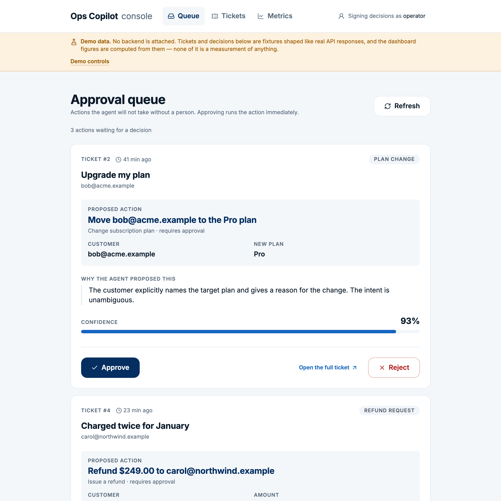
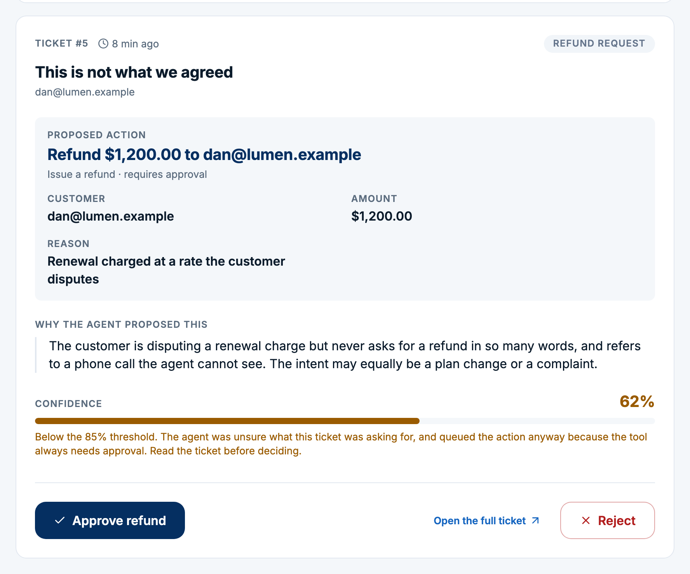
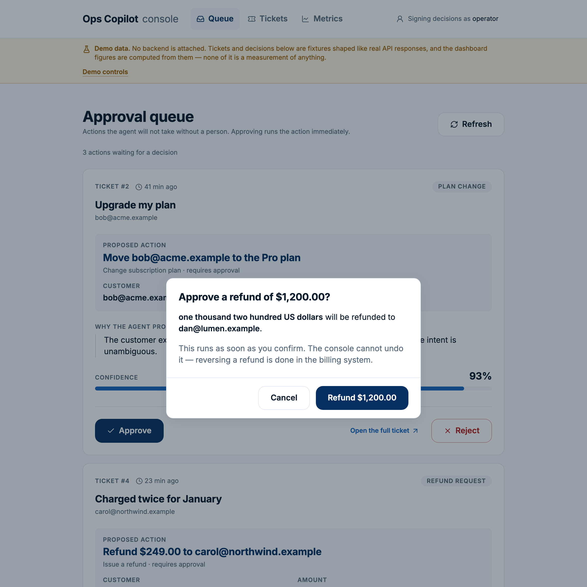
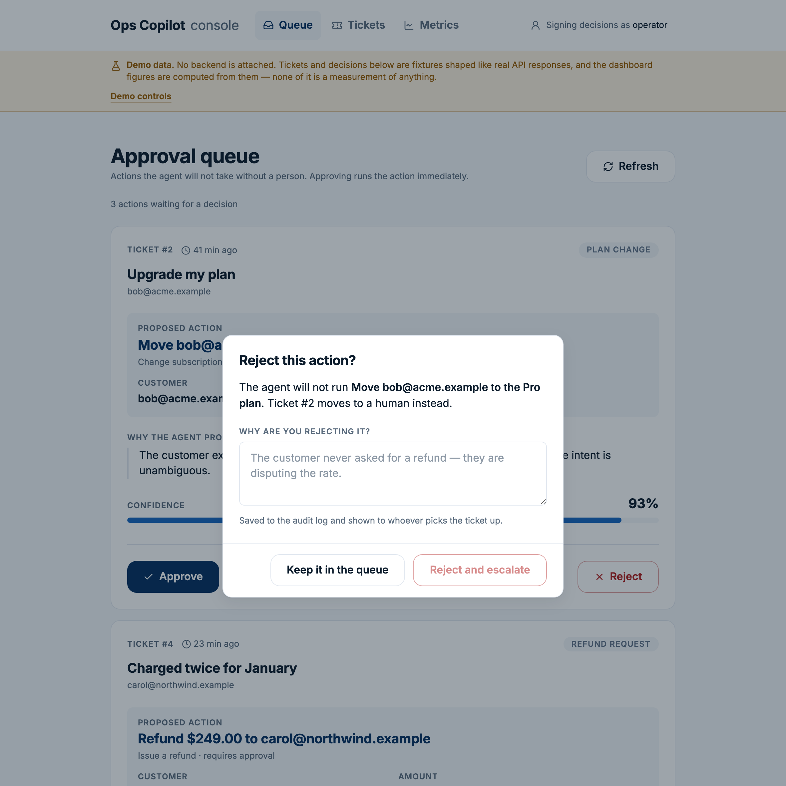
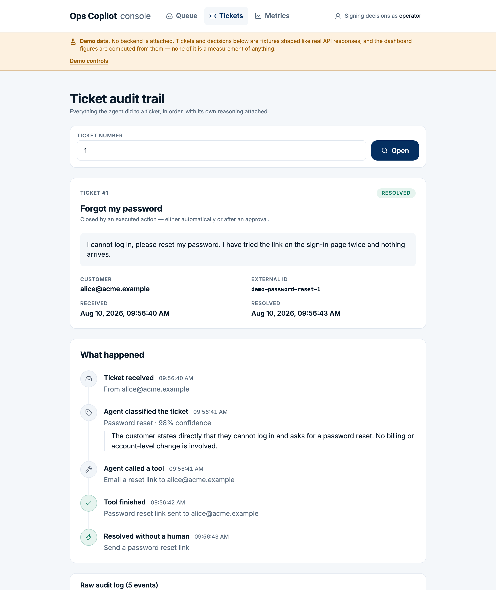
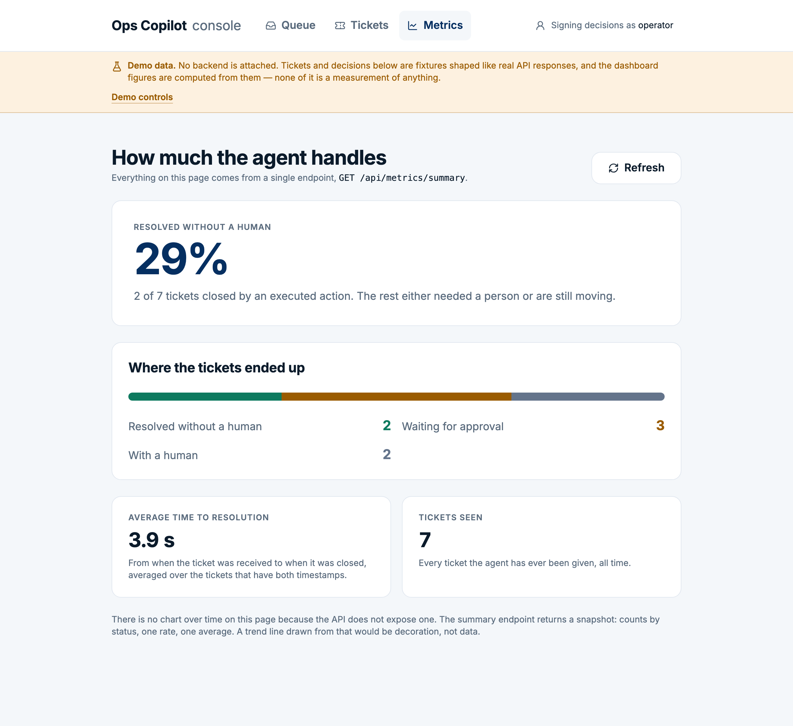
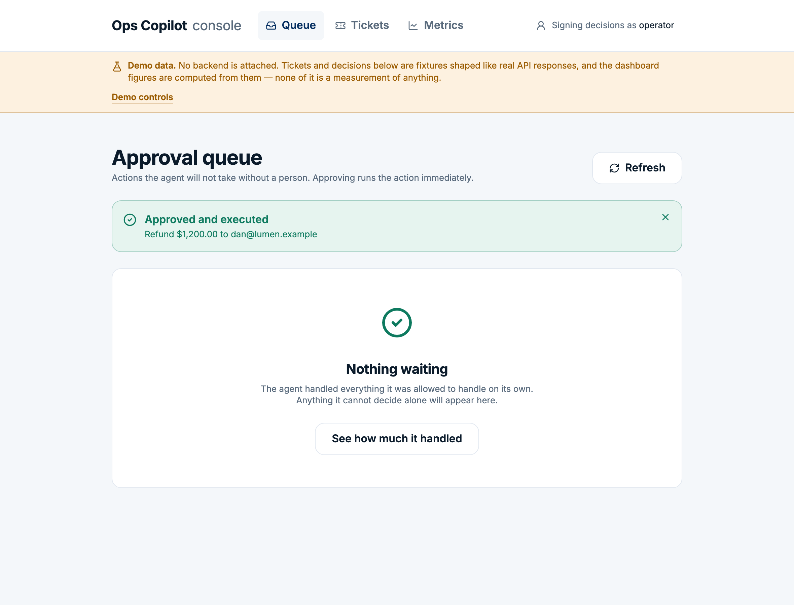
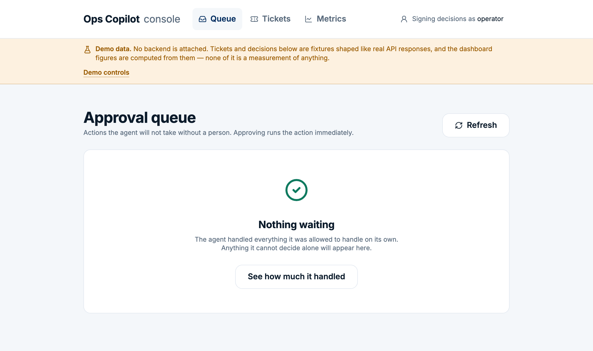
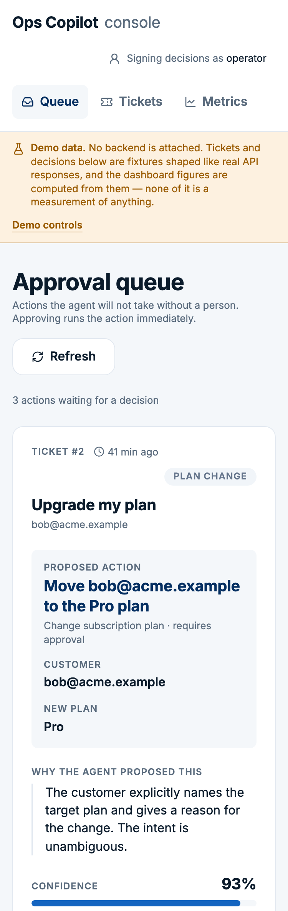

# Ops Copilot — operator console

The human half of the human-in-the-loop.

The agent in this repository refuses to issue a refund or change someone's plan on its own: it
validates the action, queues it, and waits for a person. Until this console existed, that person
approved things with `curl`. Half the product was specified, built, tested — and unusable.

**Live demo:** https://derenchukvip-pixel.github.io/ops-copilot/

The demo runs on fixtures, with no backend attached, and says so on every screen. See
[Demo mode](#demo-mode) for why.

---

## Contents

- [What it does](#what-it-does)
- [Screens](#screens)
- [Decisions worth explaining](#decisions-worth-explaining)
- [Demo mode](#demo-mode)
- [Running it](#running-it)
- [Connecting it to a real backend](#connecting-it-to-a-real-backend)
- [Tests](#tests)
- [What it deliberately does not do](#what-it-deliberately-does-not-do)

## What it does

Three screens, built on the API this repository already exposes — no endpoint was added for the
console, and one small change was made to the backend (see [CORS](#connecting-it-to-a-real-backend)).

| Screen | Endpoint |
|---|---|
| Approval queue | `GET /api/pending-actions?status=PENDING`, `POST .../approve`, `POST .../reject` |
| Ticket audit trail | `GET /api/tickets/{id}`, `GET /api/tickets/{id}/audit-log` |
| Metrics | `GET /api/metrics/summary` |

## Screens

### The approval queue



One card per waiting action, in one column, capped at 880px. The order of the card is the order
of the question: who is this about, what is about to happen to them, why does the agent think so,
how sure was it — and only then the two buttons.

Nothing prints a raw identifier. `change_subscription_plan` with
`{"customerEmail": "bob@acme.example", "targetPlan": "pro"}` reads as **Move bob@acme.example to
the Pro plan**, because the person deciding whether to move someone's money should not have to
parse snake_case first.

### Low confidence is the case that matters



It is easy to assume a queued action is always one the agent was sure about. It is not.
`DecisionEngine.decide` returns `QueueForApproval` for a `REQUIRES_APPROVAL` tool **before** it
ever compares confidence to the threshold — the threshold only gates automatic execution of safe
tools. So a 0.62-confidence refund reaches this queue looking exactly like a 0.99 one, and the
person reading the card is the only thing that catches it.

The console makes that case loud: the figure turns amber, the bar turns amber, and a sentence
says what happened and what to do about it. Three signals, because colour alone is not a signal
for roughly one man in twelve.

### Anything that moves money gets a second look



The amount appears twice: as a figure and spelled out in full. `$1,200.00` and `$120.00` are one
glyph apart and both look plausible at a glance, while *one thousand two hundred* and *one
hundred twenty* cannot be confused by someone reading quickly. If the extraction step pulled the
wrong number out of the ticket text, this is where a human catches it.

Approvals that do not move money get no dialog. A confirmation on every action is a confirmation
on none of them.

### Rejecting requires a reason



`RejectActionRequest.reason` is `@NotBlank` on the backend, so a bare "are you sure?" would only
have to be followed by a second prompt. More to the point, the reason is written to the audit log
and is the entire explanation the next person gets for why the ticket is sitting escalated in
their queue. The confirm button stays disabled until there is one.

### The audit trail



Ten `AuditEventType` constants and a free-form JSON column become a sequence a support lead can
read top to bottom. Each event gets an icon, a colour from the semantic palette, and a sentence
with the payload filled in; the model's own reasoning is quoted rather than paraphrased.

Payloads are read defensively throughout — `ERROR` alone is written from three call sites with
three different key sets. The raw JSON stays under a spoiler at the bottom of the page for anyone
who wants to check the translation.

Note that escalation is styled as a warning, not a failure. A ticket reaching a human is the
system working as designed; `ERROR` is the only status that means something broke.

### Metrics



Three honest numbers and a bar. There is no chart over time, because `GET /api/metrics/summary`
returns a snapshot — counts by status, one rate, one average — and a trend line drawn from that
would be decoration, not data. The page says so, in place of the chart.

Two details that would be easy to fake and are not:

- The endpoint reports four statuses out of the six the domain has. The four therefore need not
  add up to the total, and the difference — tickets that are `RECEIVED` or `PROCESSING` right now
  — is shown as its own segment rather than dropped, so the bar sums to the total it claims.
- `averageResolutionSeconds` is `null` when nothing has been resolved. The screen says "no
  resolved tickets yet" rather than printing a zero.

### An empty queue is good news



The first screen a new operator sees, and the one an existing operator sees most often. "No data"
would report the same fact and imply something had gone wrong.

### Someone else got there first



Two operators, one queue. Approving something that has already left `PENDING` returns 409 from
`transitionIfPending`, and the console handles that case differently from every other failure —
see below.

### 375px



Approvals do not wait for someone to reach a desk.

## Decisions worth explaining

**Optimistic writes, with an honest rollback.** The card leaves the queue the moment a decision is
made, because the operator's job is a sequence of decisions and a card that lingers for a round
trip invites a second click. Failures then have to be undone truthfully, and there are two kinds:

- The write failed and the action is still pending. The card comes back **at the index it left
  from** — appending it to the end would be a small lie about the queue's order — and the notice
  says plainly that nothing was changed.
- The write failed with 409. The action is genuinely gone, just not by this operator's hand. The
  card must *not* come back: restoring it would invite a click on something that no longer exists
  and would claim a failure where there was none.

**Approve and reject are pushed apart.** Not side by side. A misfire on either costs someone real
money, and a few hundred pixels is the cheapest safeguard available.

**The operator names themselves.** The backend defaults `reviewedBy` to the literal string
`"operator"`, which makes an audit log where every approval looks identical. There is no auth in
this system and the console does not pretend there is — the name in the header is a label, stored
locally, sent with every decision.

**Dialogs are the native `<dialog>` element**, opened with `showModal()`. Focus containment,
focus restoration, `aria-modal`, inertness of the page behind, and Escape-to-close come from the
platform rather than from three hundred lines of hand-rolled focus management that will be subtly
wrong.

**Skeletons, not spinners.** A spinner says "wait". A skeleton says "wait, and here is the shape
of what is coming".

## Demo mode

The published demo has no backend behind it. Two reasons, and the second is the one that decided it:

1. It should work when nothing is running — that is most of the point of a portfolio demo.
2. The real agent calls Anthropic on every ticket, at cost. A public URL is not a safe place to
   point at that.

So `NEXT_PUBLIC_DATA_SOURCE=demo` builds a bundle that contains fixtures and **no code path that
can reach a real API**. There is no query parameter or hidden setting that flips it at runtime.

The fixtures are hand-written, not a capture of a real Claude run, and the console says so in a
banner on every screen. What they are not is decorative:

- Every record is shaped exactly like what the backend produces, and the event sequences follow
  the three scenarios in the [root README](../README.md#demo-scenarios), which `AuditTrailIT`
  asserts.
- Approve and reject really mutate the queue and write the same audit events
  `PendingActionService` writes, in the same order. State lives in `sessionStorage`, so a refresh
  does not quietly undo the operator's work.
- **The dashboard figures are computed from the fixtures** by the same arithmetic as
  `MetricsService`, not typed in. Whatever the seven demo tickets happen to add up to is what the
  page shows. There is no tuned "look how good the agent is" percentage anywhere in this repo.

The banner also carries two switches, because the states worth showing are the ones that are hard
to reach on purpose. They exercise the genuine code paths — the conflict switch makes the demo
client throw the same 409 the API throws — rather than mocking up the screens:

| Switch | What it does |
|---|---|
| Another operator gets there first | The next approve or reject returns 409 |
| API unreachable | Every call fails, so the error and rollback behaviour are visible |

## Running it

Node 20 or newer.

```bash
npm ci
npm run dev
```

That starts in demo mode on http://localhost:3000 — no backend, no configuration.

| Script | |
|---|---|
| `npm run dev` | Development server |
| `npm run build` | Static export to `out/` |
| `npm run lint` | ESLint |
| `npm run typecheck` | `tsc --noEmit` |
| `npm test` | Vitest |

## Connecting it to a real backend

```bash
cp .env.example .env.local     # then set NEXT_PUBLIC_DATA_SOURCE=live
npm run dev
```

**The API also has to allow this origin.** The console is a static site served from somewhere
other than the API, and without an explicit allowlist the browser blocks every request before it
is sent — the queue simply never loads, and the only clue is an opaque CORS message in the
devtools console.

This is the one change the console required on the Java side: `ops-copilot.cors.allowed-origins`,
empty by default, no wildcard offered. These endpoints approve refunds, and the safe default for
that is nobody.

```bash
CORS_ALLOWED_ORIGINS=http://localhost:3000 ./mvnw spring-boot:run
```

## Tests

89 tests, `npm test`. They cover the parts where being wrong is expensive rather than the parts
that are easy to assert:

- **`domain/money.test.ts`** — spelling amounts out. `$1,200.00` and `$120.00` must never spell
  the same way; cents, singulars and rounding are covered; a numeric *string* in the parameters
  is not treated as money.
- **`domain/tools.test.ts`** — every registered tool has copy, and a tool the console has never
  heard of still renders as a readable phrase rather than an identifier.
- **`domain/audit.test.ts`** — all ten event types produce a human title, all three shapes of
  `ERROR` payload read, and no payload — null, empty, or unexpected — can put the word
  "undefined" on the screen.
- **`hooks/useApprovalQueue.test.tsx`** — the optimistic window, rollback to the original index,
  and the 409 rule that a conflicted card must stay gone.
- **`api/demo-ops-api.test.ts`** — the demo client's state transitions match the Java service's,
  a second decision on the same action is a conflict, and the metrics are arithmetic over the
  tickets rather than stored numbers.
- **`api/http-ops-api.test.ts`** — the client that talks to a real backend. These stand in for an
  end-to-end run, which needs Postgres and an Anthropic key: they pin the exact request sent for
  each call, and what the client makes of every response the API can return — 409 and 404 as
  their own types, the handler's message preferred over the status line, an HTML error page from
  a proxy not crashing the parse, an empty 200 body not being parsed at all, and an aborted
  request passing through instead of being reported as "can't reach the API".

## What it deliberately does not do

**There is no list of tickets to browse.** The API exposes `GET /api/tickets/{id}` and nothing
that lists them, so the audit-trail screen takes a ticket number; cards in the queue link
straight to it, which is how an operator actually arrives. Building a client-side list would mean
either guessing at ids or holding a cache the backend does not have.

**There is no login.** Adding one would mean inventing a security model the backend does not
have. Anyone who can reach the API can already approve anything on it; a login on the console
would be a lock on a door with no wall around it.

**There is no chart over time.** See [Metrics](#metrics).
